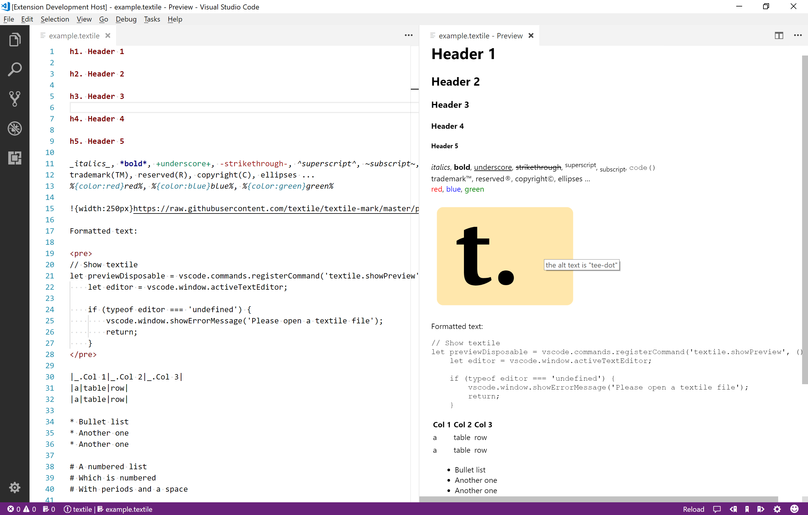

# Textile Preview

Preview [textile markup](https://github.com/textile) content from within Visual Studio Code.

This extension is a wrapper for the Node.js package [textile-js](https://www.npmjs.com/package/textile-js)

## Features

* Displays textile preview
* Preview is updated automatically
* Supports local image resources and relative paths
  * **NOTE:** Resources must be located within the active folder/workspace, or in the same folder or sub-folder of the open textile file

## Available Commands

To preview textile content, simply open a textile document and run one of the following commands from the command palette:

* `Textile: Open preview`
* `Textile: Open preview to the side`

## Release Notes

See [CHANGELOG.md](CHANGELOG.md)

---
[Follow @mr_frodge](https://twitter.com/mr_frodge)
